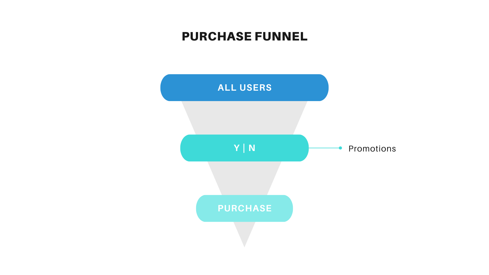
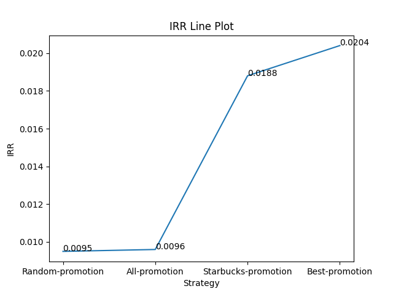
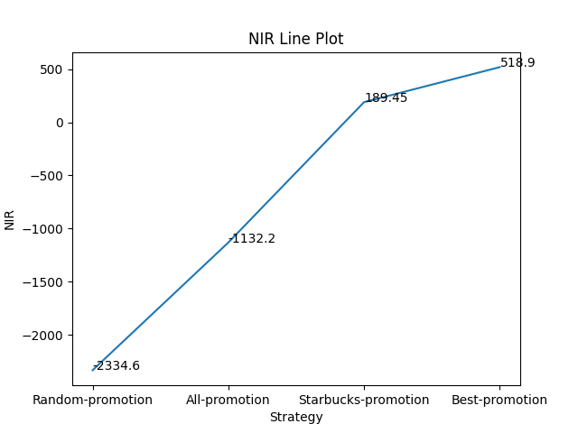

# Starbucks

> [Starbucks Take Home Assignment](https://drive.google.com/file/d/18klca9Sef1Rs6q8DW4l7o349r8B70qXM/view)<br>
> [GitHub Repo](https://github.com/ZacksAmber/Starbucks)<br>
> [Kaggle Notebook](https://www.kaggle.com/zacksshen/starbucks)

An analysis of target marketing, through A/B testing and Machine Learning. Data is from Starbucks.

---

## TL;DR

In this research, I explored the relationship between different promotion strategies and purchases from Starbucks. I am curious about two questions:

1. Do promotions bring more purchases, leading to revenue increment?
2. If so, how to maximize the purchase, resulting in a better Incremental Response Rate(IRR) and Net Incremental Revenue(NIR)?

Therefore, there are one prerequisite and two main parts to answer the above questions:

- Exploratory Data Analysis
- Part I: Applying A/B Testing for answering the 1st question.
- Part II: Implementing Machine Learning for answering the 2nd question.

---

## Motivation

Traditional A/B tests, such as UX design for a website, have no additional cost once the experiment and the website upgrade are done. But what if you have extra and continuous expenses from the new strategy, which comes from the positive feedback of the A/B test? Is this positive change in your business worth the additional costs?

In this case, we have some potential customers who are only willing to purchase with a promotion. **Every promotion costs 0.15 USD, while every sold product earns 10 USD**. If we send out promotions to inactive customers who will never purchase, we lose **0.15 USD**. Therefore, the best way to find out proactive customers and send out promotions to them as many as possible.

---

## Dataset Summary

The dataset in this research was initially used as a take-home assignment from [Starbucks](https://drive.google.com/file/d/18klca9Sef1Rs6q8DW4l7o349r8B70qXM/view) for their job candidates. It is also one optional portfolio exercise from [Udacity Data Scientist Nanodegree](https://www.udacity.com/course/data-scientist-nanodegree--nd025).

> The data for this exercise consists of about 120,000 data points split in a 2:1 ratio among training and test files. In the experiment simulated by the data, an advertising promotion was tested to see if it would bring more customers to purchase a specific product priced at $10. Since it costs the company 0.15 to send out each promotion, it would be best to limit that promotion only to those that are most receptive to the promotion. Each data point includes one column indicating whether or not an individual was sent a promotion for the product, and one column indicating whether or not that individual eventually purchased that product. Each individual also has seven additional features associated with them, which are provided abstractly as V1-V7.



---

## KPIs

Starbucks defines the KPI IRR and NIR below:

> Incremental Response Rate: IRR depicts how many more customers purchased the product with the promotion compared to if they didn’t receive the promotion.
> Net Incremental Revenue: NIR depicts how much is made (or lost) by sending out the promotion.

$$IRR = \frac{purch_{treat}}{cust_{treat}} - \frac{purch_{ctrl}}{cust_{ctrl}}$$

$$NIR = (10\cdot purch_{treat} - 0.15 \cdot cust_{treat}) - 10 \cdot purch_{ctrl}$$

---

### Flowcharts

Part I: A/B Testing Flowchart


Part II: Machine Learning


---

## Conclusions

In this research, we explored how to combine A/B Testing & Machine Learning for powering a real-world target marketing problem. By analyzing the samples with randomly assigned promotions, we conclude that promotions positively impact purchases. Then we trained and tuned Machine Learning models to maximize the IRR & NIR.

Breaking down a complicated problem into small pieces with statistical and Machine Learning solutions is an efficient way to contribute to the company's revenue, no mention how it benefits the data science and marketing department's time, budget, and human resources.

---

### Conclusion of Exploratory Data Analysis

There are 7 features (`V1` to `V7`), 1 target (`purchase`), and one more feature (`Promotion`), which is the model prediction. In the dataset `../data/training.csv`, `Promotion` was randomly assigned with the value `'Yes'` or `'No'` by Starbucks for evaluating the promotions.

- There is no Missing Values issue.
- There is an Imbalanced Dataset issue and we will handle it in the Machine Learning part.
- There is no Outliers issue.

### Conclusion of Part I: A/B Testing

$$\displaystyle IRR = \frac{purch_{treat}}{cust_{treat}} - \frac{purch_{ctrl}}{cust_{ctrl}}$$

$$\displaystyle H_0: IRR = 0$$

$$\displaystyle H_1: IRR > 0$$

$$\displaystyle \alpha = 0.05$$

$$\displaystyle p-value = 5.55 \times 10^{-36}$$

With the p-value of $5.55 \times 10^{-36}$, which is extremely small, we can reject the null hypothesis, which states that there is no difference between the two groups. And we are more than 99% confident that there is a statistically significant difference in purchase rate between the control and treatment. This means that the promotion has had a significant impact on the purchase rate. Therefore, we can infer that the promotion has been successful in increasing the purchase rate compared to the control group where no promotion was provided. We can recommend the continuation of the promotion strategy to increase sales.

It's important to note that statistical significance does not necessarily imply practical significance. And for this research, there is pre-defined practical significance. But the randomly assigned `Promotion` in `training.csv` shows that, with a `Promotion`, the `purchase` increased by **125%**. It means, by applying Machine Learning for better sending out promotions, we can get a better IRR.

---

### Conclusion of Part II: Machine Learning

My tuned model with proper hyperparameters can significantly increase the IRR and NIR. Therefore, Starbucks should apply this ML model as an IRR and NIR improvement promotion strategy. The function made by Starbucks from `src/test_results.py` has an IRR of 0.0188 and a NIR of $189.45.

- In comparison to the basic IRR (Random-promotion strategy), my solution increased IRR by **0.0109**, or **114.73%**;
- In comparison to the Starbucks IRR (Starbucks-promotion strategy), my solution increased IRR by **0.0016**, or **8.51%**;



- In comparison to the basic NIR (Random-promotion strategy), my solution increased NIR by 2853.5;
- In comparison to the Starbucks NIR (Starbucks-promotion strategy), my solution increased NIR by 329.45, or 173.90%;



---

## Instructions

### Clone GitHub Repo & Reproduce the Code

> [Pipenv](https://pypi.org/research/pipenv/)<br>
> [GitHub Repo](https://github.com/ZacksAmber/Starbucks)

```sh
# clone repo
git clone https://github.com/ZacksAmber/Starbucks.git

# change dir
cd Starbucks

# make virtual env & activate it
pipenv shell
# install necessary packages
pipenv install
# add the virtualenv as a jupyter kernel
ipython kernel install --name "Starbucks" --user
# run jupyter notebook or lab
jupyter lab


# remove kernel if you would like to
# jupyter kernelspec remove <Starbucks>
```

---

### File Structure

```sh
.
├── LICENSE
├── Pipfile
├── Pipfile.lock  # Pipenv version requirements.txt
├── README.md
├── data  # storing training and test dataset
│   ├── Test.csv
│   └── training.csv
├── notebooks  # storing notebooks
│   ├── Metric_Baseline.ipynb
│   ├── Model_Baseline.ipynb
│   ├── Model_Tuning.ipynb
│   └── Starbucks.ipynb  # main notebook
├── reports  # storing outputs from notebooks/
│   ├── baselines  # storing outputs of baseline
│   │   ├── metric_baseline.csv
│   │   └── model_baseline.csv
│   ├── img  # storing exported images
│   │   ├── irr_line_plot.png
│   │   ├── nir_line_plot.png
│   │   ├── power.png
│   │   ├── purchase_funnel.png
│   │   └── sample_size.png
│   └── tuning_results  # storing tuning result
│       └── model_tuning.csv
├── requirements.txt
└── src
    └── test_results.py
```
